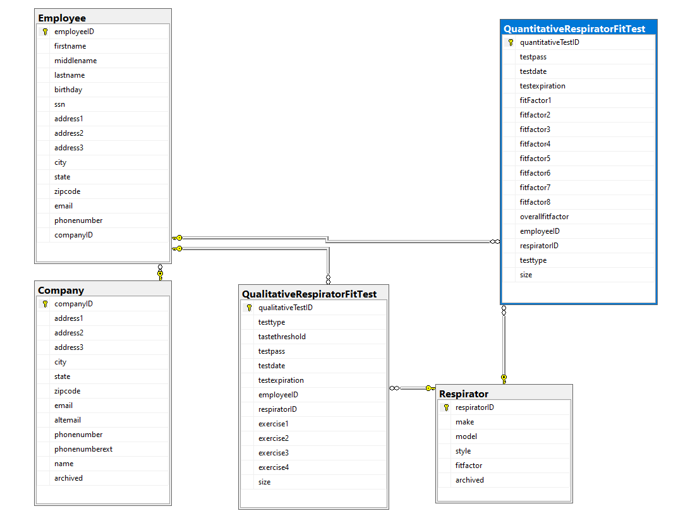

# Fit Test Database

## Table of Contents

- [Fit Test](#project-title)
- [Description](#description)
- [Database Diagram](#database-diagram)  <-- Added this line
- [Database Schema](#database-schema)  <-- Added this line

## Database Diagram

## Database Schema

<!-- Your Database Schema content goes here -->

## Description

This project is a fit test database where users can store respirator fit tests for multiple companies and their employees. Users are able to add respirator makes and models and create quantitative or qualitative fit tests for indiviudal employees. This allows the users to identify the types of respirators an employee is allowed to wear and what protocols were used for each test. This database is great for companies that provide respiratory protection testing services. This can also be adapated to individual companies with different sections who need to track personnel respiratory fit tests for OSHA compliant reasons.

## Database Diagram

## Database Schema

### Tables

#### `Company`

- **Description**: This table stores information about a company.

- **Key Fields**:
  - `companyID` (Primary Key): Unique identifier for each company.
  - `name`: Company's name.
  - `phonenumber`: Company's phone number.
  - `email`: Company's email address.
  - `archived`: Boolean value that determines if a company has been archived and can no longer be assigned employees.

#### `Employee`

- **Description**: This table stores information about employees.

- **Key Fields**:
  - `employeeID` (Primary Key): Unique identifier for each employee.
  - `companyID` (Foreign Key): References the `companyID` in the `Company` table to associate an employee with a company.
  - `firstname`, `middlename`, `lastname`: Employee's name components.
  - `birthay`: Employee's birthday.

#### `Respirator`

- **Description**: This table stores information about respirators that can be used in creating fit tests.

- **Key Fields**:
  - `respiratorID` (Primary Key): Unique identifier for each respirator.
  - `make`: Manufacturer make of the respirator.
  - `model`: Manufacturer model of the respirator.
  - `style`: The respirator style (e.g., half face, full face).
  - `fitfactor`: OSHA-assigned protection factor.
  - `archived`: Boolean value to archive respirators.

#### `QuantitativeRespiratorFitTest`

- **Description**: This table stores information about quantitative fit tests.

- **Key Fields**:
  - `quantitativeTestID` (Primary Key): Unique identifier for each quantitative fit test.
  - `employeeID` (Foreign Key): References the `employeeID` in the `Employee` table to associate a quantitative fit test with an employee.
  - `respiratorID` (Foreign Key): References the `respiratorID` in the `Respirator` table to associate a quantitative fit test with a respirator.
  - `testdate`: Date of the fit test.
  - `testexpiration`: Fit test expiration date.
  - `overallfitfactor`: Overall fit factor during the test.
  - `testpass`: Boolean value indicating if the test passed.

#### `QualitativeRespiratorFitTest`

- **Description**: This table stores information about qualitative fit tests.

- **Key Fields**:
  - `qualitativeTestID` (Primary Key): Unique identifier for each qualitative fit test.
  - `employeeID` (Foreign Key): References the `employeeID` in the `Employee` table to associate a qualitative fit test with an employee.
  - `respiratorID` (Foreign Key): References the `respiratorID` in the `Respirator` table to associate a qualitative fit test with a respirator.
  - `testdate`: Date of the fit test.
  - `testexpiration`: Fit test expiration date.
  - `testtype`: OSHA protocol used for the test.
  - `testpass`: Boolean value indicating if the test passed.

### Relationships

- The `Company` table has a one-to-many relationship with the `Employee` table. Each company can have multiple employees.
- The `Employee` table has a one-to-many relationship with the `QualitativeRespiratorFitTest` table. Each employee can have multiple qualitative respirator fit tests.
- The `Employee` table has a one-to-many relationship with the `QuantitativeRespiratorFitTest` table. Each employee can have multiple quantitative respirator fit tests.
- The `Respirator` table has a one-to-many relationship with both the `QuantitativeRespiratorFitTest` and `QualitativeRespiratorFitTest` tables. Each respirator can be assigned to multiple fit tests.
  
## Contact
Email: anthonymorton760@gmail.com
LinkedIn: https://www.linkedin.com/in/anthony-louis-morton/

